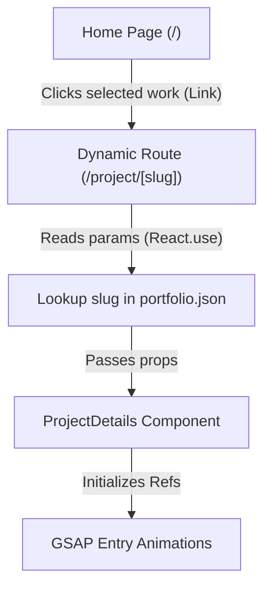

# Project Details Component Documentation

This document describes the design, architecture, and integration of the `ProjectDetails` component and its dynamic routing in the portfolio application.

---

## 1. System Architecture & Flow

The portfolio application uses Next.js App Router. The navigation flow is structured as follows:



---

## 2. API & Component Reference

### Component: `ProjectDetails`
- **File**: [`src/components/ProjectDetails.tsx`](file:///mnt/projects/Salman-new-Portfolio/src/components/ProjectDetails.tsx)
- **Type**: Client Component (`"use client"`)

### Data Structures & Props

```typescript
export interface TeamMember {
  id: string;
  name: string;
  role: string;
  avatarUrl?: string; // Optional custom avatar image URL
  email?: string;     // Optional email (adds hover email action)
}

export interface Milestone {
  id: string;
  name: string;
  description?: string;
  status: "pending" | "in-progress" | "completed";
  dueDate?: string;    // Format: "MMM DD, YYYY"
}

export interface ProjectDetailsProps {
  title: string;
  status: "Planning" | "In Progress" | "In Review" | "Completed" | "On Hold" | "Blocked";
  clientName: string;
  startDate: string;
  endDate: string;
  budget: number;      // Numeric budget (auto-formatted to locale currency)
  currencyCode?: string; // e.g. "USD" (defaults to "USD")
  projectLead: {
    name: string;
    role: string;
    avatarUrl?: string;
    email?: string;
  };
  description: string;
  progress: number;    // Value from 0 to 100
  milestones?: Milestone[];
  team: TeamMember[];
  onPrimaryAction?: () => void;   // Click callback for primary button (Edit)
  onSecondaryAction?: () => void; // Click callback for secondary button (Share)
  primaryActionLabel?: string;   // Defaults to "Edit Project"
  secondaryActionLabel?: string; // Defaults to "Share"
  onBack?: () => void;           // Back-navigation callback
}
```

---

## 3. Dynamic Routing Integration

The dynamic route is implemented in **[`src/app/project/[slug]/page.tsx`](file:///mnt/projects/Salman-new-Portfolio/src/app/project/%5Bslug%5D/page.tsx)**.

- **React 19 Async Parameters**: Next.js App Router dynamic route parameters are asynchronous promises. The dynamic slug is resolved on the client using React's `use` hook:
  ```typescript
  const { slug } = use(params);
  ```
- **Data Lookup**: The resolved `slug` is used to search the projects list in `src/data/portfolio.json`. If a project match is not found, the component displays an interactive warning card allowing the user to return to the home page.

---

## 4. GSAP & Scroll Animations

Scroll and entry animations are powered by GSAP and `@gsap/react`:

1. **Header Entry**: Slides down and fades in (`{ y: -20, opacity: 0 }` to `{ y: 0, opacity: 1 }`).
2. **Metadata Grid Cards**: Staggered slide-up and fade-in when scrolling down.
3. **Bento Grid Panels**: Staggered fade-in using vertical translation offset (`y: 40`).
4. **Contributors List**: Staggered pop-in using scale transformations (`scale: 0.95` to `1`) and scroll trigger anchors.

---

## 5. UI Custom Utilities

- **Deterministic Gradient Avatars**: Uses the `getAvatarGradient` utility to calculate the character-code sum of the member's name and choose one of five premium gradient combinations.
- **Status Badges**: Custom styling mapper `getStatusStyles` that maps semantic values (`In Progress`, `Completed`, `Blocked`, etc.) to specific borders, background fills, and animated pulse indicator classes.
